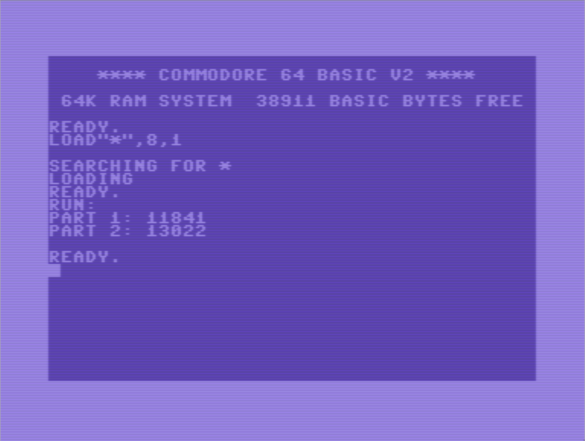

# Advent of Code 2022
## [Day 2](https://adventofcode.com/2022/day/2) - Rock Paper Scissors

### Programming Language 

The [6502](https://en.wikipedia.org/wiki/MOS_Technology_6502) microprocessor was ubiquitous in the early to mid-80s, powering almost all of the popular home computers and video games consoles.
Atari 2600, Apple II, Atari 400/800, Commodore 64, NES, and many more were all powered by a 6502.

### Why I Chose It

I found a book on 6502 assembly language in high school.
I used that, along with the documentation that came with the Atari Macro Assembler, to teach myself how to program my Atari 800 in assembly.
I mostly used it for playing around with the Atari's "Player Missile Graphics", which we would call hardware-assisted sprites these days.

The largest program I ever wrote in 6502 assembly was a Zork-like text adventure that was playable but I never completed.
Pretty sure the only reason I decided to do it in assembly was just to see if I could, since it would have been much easier to write in BASIC.

### How It Went

Today's puzzle was very well suited to 6502 assembly.
It only required summing 8-bit integers and the final result fit in 16-bits.

For the input data, I briefly considered investigating how to read a file use the Commodore 64 KERNAL (sic) functions.
But I realized I wanted to spend my time solving the actual puzzle rather than navigating the intricacies of reading and parsing files in assembly code.
So I wrote a quick Python script that converted the AoC input into an assembly file I could include from my main program.
It stores each line from the original input as two bytes and adds a terminating 0 at the end.

The only difficulty I had was that originally I looped through the input data using the Y register as an index.
That worked for the simple example given in the puzzle's text which had only three games.
However it went into an infinite loop when I tried to run it on my actual input.
I pretty quickly realized that the actual input had way more than 128 games which is the most I could handle in an 8-bit register.
Fixed it by using a zero-page address to hold a pointer to the next piece of game data and accessed it indirectly through that.

For part 2, I simply created a new table of scores for each combination and use a zeropage pointer to specify which table to use.

### Tools

- [ACME Cross Assembler](https://github.com/meonwax/acme/) 
- [VICE](https://vice-emu.sourceforge.io/) Commodore 64 emulator

### Running

Install the tools mentioned above.

1. Install Acme. The easiest way to do this is using Homebrew:
`brew install acme`
2. Install VICE. You apparently can install this using Homebrew as well, but I had some difficulties.
I recommend using a pre-built [installer](https://vice-emu.sourceforge.io/index.html#download) from their SourceForge repository.
Don't forget to add it to your PATH if you want to run my scripts from the command line.

To automatically fetch your input file and run the program, enter:

```
make run
```

That will fetch and convert your input file, use Acme to assemble the source, convert the resulting object code to a d64 file, and open it in VICE to run it.

### Screenshot


